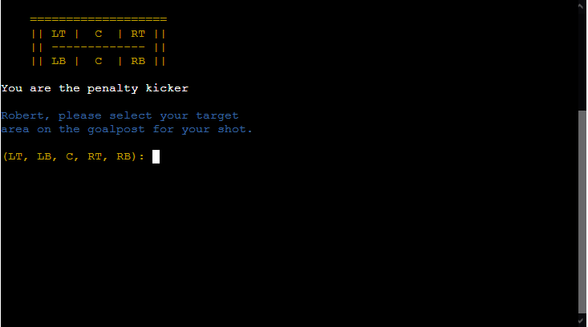

# [PENALTY SHOOTOUT GAME](https://penalty-shootout-game-8766b5475b75.herokuapp.com)

### Introduction

Experience the excitement of a realistic penalty shoot-out game from your terminal with our interactive game. This project aims to design an immersive experience that allows users to engage in a simulated penalty shoot-out, making strategic decisions just like in an actual game. The game was created with Python, highlighting the language’s flexibility and strength. This is part of the third portfolio project of the Code Institute course.

#### Target Audience ⁤

The primary focus of the target audience is football enthusiasts, gamers, and anyone intrigued by interactive command-line games. Whether you are a seasoned football fan wanting to simulate the thrill of a penalty shoot-out, a casual gamer looking for a quick and fun distraction, or a Python learner interested in seeing what the language can do, this game is for you.

#### Value Proposition ⁤

Immerse yourself in penalty shoot-outs from the comfort of your desk. The game goes beyond mere victories or defeats. It is about the path you take and the choices you make. It combines strategy and chance, recreating a real penalty shoot-out's unpredictable nature and high stakes. Each decision you make, whether shooting or guarding the goal, can alter the game. The game is designed to be interactive and enjoyable, regardless of your football knowledge or gaming proficiency.

Source: [amiresponsive](https://ui.dev/amiresponsive?url=https://penalty-shootout-game-8766b5475b75.herokuapp.com)

## UX

In this project, I follow the Five Planes of User Experience model invented by Jesse James Garrett.

### Five Planes of User Experience

This model aids in transforming from abstract ideas, such as creating objectives of the project and identifying the user needs, to concrete concepts, such as assembling visual elements together to produce the visual design of the idea to meet the project's objectives and users' needs.

#### The Strategy Plane

This project centred around creating a captivating command-line game that mimics the experience of a football penalty shootout. This game was designed to entertain players, challenge their decision-making abilities, and showcase Python’s development potential.

#### The Scope Plane

The game was designed to incorporate essential elements of a penalty shootout. The included elements are the coin toss for determining who goes first, choosing the target area, deciding which area to defend, and calculating and displaying scores. The game was created to be replayable, offering unique outcomes in every playthrough.

##### Content requirements:
- Clear and concise guidelines for playing, including shooting and defending.
- The latest game status, including the score and whose turn it is.
- Instant feedback on the result of each turn, like whether a shot was successful or saved.

##### Functionality requirements:
- Players can input their decisions in the game, whether it is selecting a target area for a shot or choosing an area to defend.
- The game must correctly execute the penalty shoot-out rules, with the user and computer opponent taking turns.
- The game should have replayability, allowing users to play again without restarting the program.

#### The Structure Plane

Please refer to the [Data Model](#DataModel) section for more detailed data model.

#### The Skeleton Plane

The game’s interface is text-based. Information is presented to the user in a clear and organised manner. The purpose of user input prompts is to be straightforward and clear. The implementation of error handling helps direct the user to valid inputs.

#### The Surface Plane

[Click here to view the live site.](https://penalty-shootout-game-8766b5475b75.herokuapp.com/)

## User Stories

### New Site Users

- As a new site user, I would like to understand how to play the game so I can start playing without confusion.
- As a new site user, I would like to get immediate feedback on my actions to understand the consequences of my decisions in the game.
- As a new site user, I would like to see my current score and progress in the game to keep track of my progress.

### Returning Site Users

- As a returning site user, I would like to be able to start a new game quickly so that I can jump back into the action without unnecessary delays.
- As a returning site user, I would like to replay the game with the same consistent experience so that I can continue to enjoy it.

## Features

### Existing Features

- **Main Menu**

When the file is loaded, this is the first page that features the ASCII image of Penalty Shootout with instructions for the game. Ultimately, the game asks the player to input their name before starting. Also, it displays the error handling message to guide the player in inputting the correct one.

| Start | End |
| - | - |
|  |  |
|  | - |

- **Coin Toss**

The coin toss allows the game to determine who should take the penalty kick first. It contains the coin that gives the player a head or a tail. Once chosen, the game will display the outcome of the coin toss with a green or red background to tell if you have won or lost the coin toss. Also, it displays the error handling message to guide the player in inputting the correct one.

| Start | End |
| - | - |
|  |  |
|  |  |

- **Penalty Shootout game**

The penalty shootout game starts with either the player or the opponent taking the first penalty kick based on the outcome of the coin toss result. The game displays the ASCII image of the goalpost guiding the player of a target area to save or to score depending on their turn. It will then display whether the player scores as a penalty kicker or save as a goalkeeper. Also, it shows the error handling message to guide the player in inputting the correct one.

| Start | End |
| - | - |
|  |  |
|  |   |
|  |  |

- **Penalty Shootout result**

Whoever scores 5 goals within 10 turns or has a +1 goal advantage with more than 10 turns wins the game. The result will be displayed whether the player wins the game or not. Finally, the player will be asked whether to restart the game or exit the game. Also, it shows the error handling message to guide the player in inputting the correct one.

| Start | End |
| - | - |
|  |  |
|  |   |
|  | - |

### Future Features

- Realistic team names imported from the real-world football data.
- Offers the player to play the knock-out game where the player wins the penalty shootout and is advanced to the next round from 1/16 to the final.

## Tools & Technologies Used

-  used to generate README and TESTING templates.
-  used for version control. (`git add`, `git commit`, `git push`)
-  used for secure online code storage.
-  used as a cloud-based IDE for development.
-  used as the back-end programming language.
-  used for hosting the deployed back-end site.
-  used to help debug, troubleshoot, and explain things.
- [MyDraw](https://www.mydraw.com/) used to create a flowchart.
- [CI Python Linter](https://pep8ci.herokuapp.com/#) used to maintain high quality of Python programming.

## Data Model

### Flowchart

To follow best practice, a flowchart was created for the game's logic, and mapped out before coding began using a paid version of [MyDraw](https://www.mydraw.com/).

Below is the flowchart of the main process of this Python program. It shows the entire cycle of the program.

**Screenshot of the flowchart here**

### Functions

The primary functions used on this application are:

- `clear_old_term()`
    - Clear the previous terminal output.
- `request_player_name()`
    - Ask the player to input their name and their name is used throughout the game.
- `main_menu()`
    - The main menu of the game that contains instructions of the game and request player's name before continuing the game.
- `toss_coin()`
    - Ask the player to choose a head or a tail before tossing a coin to determine who takes the penalty kick first.
- `print_goalpost()`
    - A reusable ASCII image of goalpost throughout the penalty shooutout game.
- `print_goal()`
    -  A reusable ASCII image of GOAL throughout the penalty shooutout game.
- `print_save()`
    - A reusable ASCII image of SAVE throughout the penalty shootout game.
- `print_win()`
    -  A reusable ASCII image of WIN at the end of the penalty shootout result.
- `print_lose()`
    - A reusable ASCII image of LOSE at the end of the penalty shootout result.
- `choose_goalpost()`
    -  A reusable function to randomise the opponent's goalpost target choice on every turn.
- `play_game()`
    - The penalty shootout game.
- `game()`
    - Runs all program functions and asks the player to restart the game or exit the game.

### Imports

I have used the following Python packages and external imported packages:
- `os`: used for adding a `clear_old_term()` function
- `colorama`: used for including color in the terminal
- `random`: used to get a random choice from a list

## Testing

> [!NOTE]  
> For all testing, please refer to the [TESTING.md](TESTING.md) file.

## Deployment

Code Institute has provided a [template](https://github.com/Code-Institute-Org/python-essentials-template) to display the terminal view of this backend application in a modern web browser.
This is to improve the accessibility of the project to others.

The live deployed application can be found deployed on [Heroku](https://penalty-shootout-game-8766b5475b75.herokuapp.com).

### Heroku Deployment

This project uses [Heroku](https://www.heroku.com), a platform as a service (PaaS) that enables developers to build, run, and operate applications entirely in the cloud.

Deployment steps are as follows, after account setup:

- Select **New** in the top-right corner of your Heroku Dashboard, and select **Create new app** from the dropdown menu.
- Your app name must be unique, and then choose a region closest to you (EU or USA), and finally, select **Create App**.
- From the new app **Settings**, click **Reveal Config Vars**, and set the value of KEY to `PORT`, and the value to `8000` then select *add*.
- If using any confidential credentials, such as CREDS.JSON, then these should be pasted in the Config Variables as well.
- Further down, to support dependencies, select **Add Buildpack**.
- The order of the buildpacks is important, select `Python` first, then `Node.js` second. (if they are not in this order, you can drag them to rearrange them)

Heroku needs three additional files in order to deploy properly.

- requirements.txt
- Procfile
- runtime.txt

You can install this project's **requirements** (where applicable) using:

- `pip3 install -r requirements.txt`

If you have your own packages that have been installed, then the requirements file needs updated using:

- `pip3 freeze --local > requirements.txt`

The **Procfile** can be created with the following command:

- `echo web: node index.js > Procfile`

The **runtime.txt** file needs to know which Python version you're using:
1. type: `python3 --version` in the terminal.
2. in the **runtime.txt** file, add your Python version:
	- `python-3.9.18`

For Heroku deployment, follow these steps to connect your own GitHub repository to the newly created app:

Either:

- Select **Automatic Deployment** from the Heroku app.

Or:

- In the Terminal/CLI, connect to Heroku using this command: `heroku login -i`
- Set the remote for Heroku: `heroku git:remote -a app_name` (replace *app_name* with your app name)
- After performing the standard Git `add`, `commit`, and `push` to GitHub, you can now type:
	- `git push heroku main`

The frontend terminal should now be connected and deployed to Heroku!

### Local Deployment

This project can be cloned or forked in order to make a local copy on your own system.

For either method, you will need to install any applicable packages found within the *requirements.txt* file.

- `pip3 install -r requirements.txt`.

If using any confidential credentials, such as `CREDS.json` or `env.py` data, these will need to be manually added to your own newly created project as well.

#### Cloning

You can clone the repository by following these steps:

1. Go to the [GitHub repository](https://github.com/RoBizMan/penalty-shootout-game) 
2. Locate the Code button above the list of files and click it 
3. Select if you prefer to clone using HTTPS, SSH, or GitHub CLI and click the copy button to copy the URL to your clipboard
4. Open Git Bash or Terminal
5. Change the current working directory to the one where you want the cloned directory
6. In your IDE Terminal, type the following command to clone my repository:
	- `git clone https://github.com/RoBizMan/penalty-shootout-game.git`
7. Press Enter to create your local clone.

Alternatively, if using Gitpod, you can click below to create your own workspace using this repository.

Please note that in order to directly open the project in Gitpod, you need to have the browser extension installed.
A tutorial on how to do that can be found [here](https://www.gitpod.io/docs/configure/user-settings/browser-extension).

#### Forking

By forking the GitHub Repository, we make a copy of the original repository on our GitHub account to view and/or make changes without affecting the original owner's repository.
You can fork this repository by using the following steps:

1. Log in to GitHub and locate the [GitHub Repository](https://github.com/RoBizMan/penalty-shootout-game)
2. At the top of the Repository (not top of page) just above the "Settings" Button on the menu, locate the "Fork" Button.
3. Once clicked, you should now have a copy of the original repository in your own GitHub account!