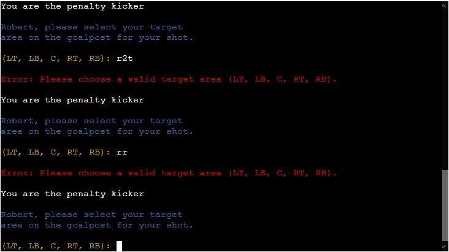
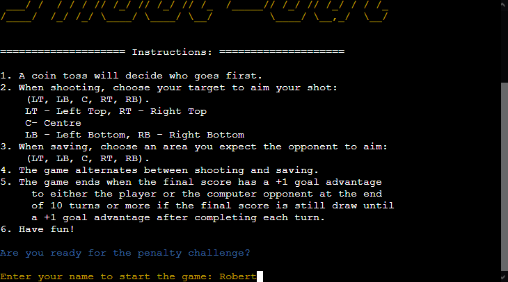
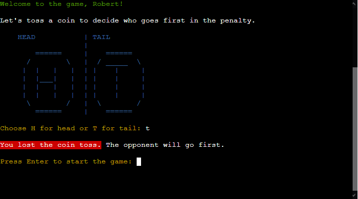
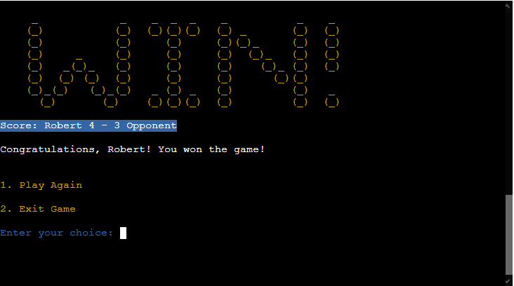

# Testing

> [!NOTE]  
> Return back to the [README.md](README.md) file.

## Code Validation

### Python

I have used the recommended [PEP8 CI Python Linter](https://pep8ci.herokuapp.com) to validate all of my Python files.

| File | CI URL | Screenshot | Notes |
| --- | --- | --- | --- |
| run.py | [PEP8 CI](https://pep8ci.herokuapp.com/https://raw.githubusercontent.com/RoBizMan/penalty-shootout-game/main/run.py) |  | All clear, no errors found |

## Browser Compatibility

I have tested my deployed project on multiple browsers to check for compatibility issues.

| Browser | Home | Notes |
| --- | --- | --- |
| Chrome |  | Works as expected |
| Firefox |  | Works as expected |
| Edge |  | Works as expected |
| Ulaa |  | Works as expected |

## Defensive Programming

Defensive programming was manually tested with the below user acceptance testing:

| Page | Expectation | Test | Result | Fix | Screenshot |
| --- | --- | --- | --- | --- | --- |
| Main Menu | | | | | |
| | When a player inputs their name using letter and less than 40 characters, it is expected to go to the coin toss and display the welcome message with the name of the player. | Tested the name input by typing Robert. | The feature behaved as expected, and it did went to the coin toss and displayed the player's name beside the welcome message. | Test concluded and passed |  |
| | When the player inputs their name using letter and exceeds 40 characters, it is expected to display the error and tell a player to input their name again but not to exceed 40 characters. | Tested the name input by typing letters randomly that exceeded 40 characters limit. | The feature behaved as expected, and it handled the error well. | Test concluded and passed |  |
| | When the player inputs their name other than alphabetic letters, it is expected to display the error and tell a player to input their name using alphabetic letters. | Tested the name input by randomly typing @, Rob2, 21, Rob!, `space`, `space`Rob and blank (just press `Enter` button). | The feature behaved as expected, and it handled the error well. | Test concluded and passed |   |
| Coin Toss | | | | | |
| | When the player chooses the side of a coin, it is expected to display the outcome of coin toss with a green background to indicate that you won the coin toss and takes the penalty kick first or red background to indicate that you lost the coin toss and the opponent takes the penalty kick first. | Tested the outcome of the coin toss by inputting either H or T. | The feature behaved as expected, it displayed the outcome of the coin toss and who takes the penalty kick first. | Test concluded and passed |   |
| | When the player won the coin toss, it is expected for the player to take the penalty kick first on the next screen output. | Tested the winning outcome of the coin toss. | The feature behaved as expected, the player took the penalty kick first. | Test concluded and passed |  |
| | When the player lost the coin toss, it is expected for the player to take as a goalkeeper in the penalty shootout on the next screen output. | Tested the losing outcome of the coin toss. | The feature behaved as expected, the player took as a goalkeeper. | Test concluded and passed |  |
| | When the player inputs any keys other than their choice (H for Head or T for Tail), it is expected to display the error and tell a player to input H for Head or T for Tail. | Tested the choice input by pressing Enter key (no input) and randomly typing a, 1, hh, 2h, and @. | The feature behaved as expected, and it handled the error well. | Test concluded and passed |  |
| | When the player inputs any keys other than pressing Enter key to start the game after the coin toss output, it is expected to display the error and tell a player to press the Enter key. | Tested the choice input by adding Space key, and randomly typing r, 1, and @. | The feature behaved as expected, and it handled the error well. | Test concluded and passed |  |
| Penalty Shootout game | | | | | |
| | When the player chooses a target on the goalpost, it is expected to display the outcome of their choice by showing "GOAL" in green which player scores or "SAVE" in red which player fails to score | Tested the winning and losing outcome on the player's penalty kick | The feature behaved as expected, and it displayed the result of the penalty kick. | Test concluded and passed |   |
| | When the player chooses a target to save on the goalpost, it is expected to display the outcome of their choice by showing "GOAL" in red which player fails to save from the opponent's goal or "SAVE" in green which player successfully prevent the opponent from scoring a goal. | Tested the winning and losing outcome on the player's goalkeeper | The feature behaved as expected, and it displayed the result of the penalty kick. | Test concluded and passed |   |
| | When the player inputs any keys other than specified targets (LT, LB, C, RT, and RB), it is expected to display the error and tell a player to select a specific target. | Tested the choice input by pressing Enter key, Space key, and randomly typing g, 5, r2t, rr, and &. | The feature behaved as expected, and it handled the error well. | Test concluded and passed |    |
| | When the player inputs any keys other than pressing Enter key to continue the next turn after the penalty result, it is expected to display the error and tell a player to press the Enter key. | Tested the choice input by adding Space key, and randomly typing a, 2, and @. | The feature behaved as expected, and it handled the error well. | Test concluded and passed |  |
| Final result | | | | | |
| | When the player wants to reset the game, it is expected to restart the game and go back to the main menu. | Tested by restarting the game within the CLI. | The feature behaved as expected, and it returned to the main menu | Test concluded and passed |  |
| | When the player wants to exit the game, it is expected to display the message that the game is exited and no more input is being accepted. | Tested by choosing to exit the game within the terminal. | The feature behaved as expected, and it ended the game and no further input is accepted. | Test concluded and passed |  |
| | When the player inputs any keys other than 1 or 2, it is expected to display the error and tell a player to choose between 1 or 2. | Tested the choice input by adding Space key, pressing Enter button, and randomly typing u, %, 3 and 1a. | The feature behaved as expected, and it handled the error well. | Test concluded and passed |    |
## User Story Testing

| User Story | Screenshot |
| --- | --- |
| As a new site user, I would like to understand how to play the game so I can start playing without confusion. |   |
| As a new site user, I would like to get immediate feedback on my actions to understand the consequences of my decisions in the game. |     |
| As a new site user, I would like to see my current score and progress in the game to keep track of my progress. |   |
| As a returning site user, I would like to be able to start a new game quickly so that I can jump back into the action without unnecessary delays. |  |
| As a returning site user, I would like to replay the game with the same consistent experience so that I can continue to enjoy it. |   |